# Automations & Scheduled Tasks

> **Location**: All automations run on the NUC (`172.30.0.169`)  
> **Last Updated**: 2026-01-25

This document tracks all automated workflows and scheduled tasks that help organize my digital life. Update this whenever a new automation is created.

## Architecture Overview

```mermaid
flowchart TB
    subgraph External["External Services"]
        READWISE["📚 Readwise Reader"]
        PLAUD["🎙️ Plaud.ai"]
        GMAIL["📧 Gmail"]
        GFORM["📝 Google Form"]
    end

    subgraph NUC["NUC Server (172.30.0.169)"]
        subgraph n8n["n8n Workflows"]
            RD["Readwise Daily Digest v3"]
            PE["Plaud Emails to Drive"]
            GJ["Gemini Journal to Drive"]
        end

        subgraph systemd["systemd Timers"]
            AI["ai-sorter.timer"]
            PA["plaud-automation.timer"]
        end

        GEMINI["🤖 Gemini AI"]
    end

    subgraph Storage["Google Drive"]
        INBOX["📥 Inbox"]
        PLAUD_FOLDER["🎙️ Plaud Recordings"]
        JOURNAL_FOLDER["📓 Journal"]
        SORTED["📂 Sorted Folders"]
    end

    subgraph Notifications["Notifications"]
        GCHAT["💬 Google Chat\n(Automations Space)"]
    end

    %% Data flows
    READWISE -->|"API: top 3 articles"| RD
    RD -->|"summarize"| GEMINI
    RD -->|"daily digest"| GCHAT

    PLAUD -->|"email with audio"| GMAIL
    GMAIL -->|"trigger"| PE
    PE -->|"upload"| PLAUD_FOLDER

    GFORM -->|"submission"| GJ
    GJ -->|"save entry"| JOURNAL_FOLDER

    AI -->|"organize files"| INBOX
    INBOX -->|"sorted"| SORTED

    PA -->|"sync recordings"| PLAUD_FOLDER
```



### Data Flow Summary

| Source               | Automation              | Destination    | Frequency  |
| -------------------- | ----------------------- | -------------- | ---------- |
| Readwise Reader      | Readwise Daily Digest   | Google Chat    | Daily 7 AM |
| Gmail (Plaud emails) | Plaud Emails to Drive   | Google Drive   | On email   |
| Google Form          | Gemini Journal to Drive | Google Drive   | On submit  |
| Drive Inbox          | ai-sorter.timer         | Sorted folders | Daily 3 AM |
| Plaud.ai             | plaud-automation.timer  | Google Drive   | Daily 7 AM |

---

## n8n Workflows

### Readwise Daily Digest v3

| Property    | Value                              |
| ----------- | ---------------------------------- |
| **Status**  | ✅ Active                          |
| **Trigger** | Cron: 7:00 AM ET daily             |
| **Account** | `tariq@techs4good.org` (Workspace) |

**What it does:**

1. Fetches the top 3 unread articles from Readwise Reader (location: "later")
2. Sends articles to Gemini AI for summarization
3. Posts a formatted daily digest to Google Chat "Automations" space

**Flow:**

```
Schedule Trigger → Fetch Readwise → Filter & Aggregate → Check If Empty → AI Agent → Post to Google Chat
                                                                            ↑
                                                            OpenAI Chat Model (Gemini)
```

**Key Files:**

- [Workflow JSON](file:///home/takhan/github/tariqk00/toolbox/n8n/readwise_daily_digest.json)

**Credentials Required:**

- `Readwise API` (Header Auth)
- OpenAI API (with Gemini base URL override)

---

### Plaud Emails to Drive

| Property    | Value                                    |
| ----------- | ---------------------------------------- |
| **Status**  | ✅ Active                                |
| **Trigger** | Gmail poll (new emails with Plaud label) |
| **Account** | `takhan@gmail.com`                       |

**What it does:**

1. Monitors Gmail for new Plaud.ai recording emails
2. Extracts audio file attachments from emails
3. Uploads recordings to Google Drive
4. Removes the Gmail label after processing

**Flow:**

```
Gmail Trigger → Split Out → Upload file → Get many messages → Remove label from message
```

**Credentials Required:**

- Gmail OAuth2 (`takhan@gmail.com`)
- Google Drive OAuth2

---

### Gemini Journal to Drive

| Property    | Value                  |
| ----------- | ---------------------- |
| **Status**  | ✅ Active              |
| **Trigger** | Google Form submission |
| **Account** | TBD                    |

**What it does:**

1. Listens for journal entries submitted via Google Form
2. Parses the submission date
3. Uploads the journal entry to Google Drive

**Flow:**

```
On form submission → Parse Date → Upload to Drive
```

**Credentials Required:**

- Google Forms/Sheets OAuth2
- Google Drive OAuth2

---

## systemd Timers

### ai-sorter.timer

| Property     | Value               |
| ------------ | ------------------- |
| **Status**   | ✅ Active           |
| **Schedule** | 3:00 AM UTC daily   |
| **Service**  | `ai-sorter.service` |

**What it does:**
Uses AI to automatically organize files in the Google Drive Inbox folder, routing them to appropriate destinations based on file type and content.

**Script:**

- [drive_organizer.py](file:///home/takhan/github/tariqk00/toolbox/google-drive/drive_organizer.py)

**Command:**

```bash
/home/tariqk/github/tariqk00/toolbox/google-drive/venv/bin/python3 \
  /home/tariqk/github/tariqk00/toolbox/google-drive/drive_organizer.py \
  --inbox --execute
```

**Management:**

```bash
# Check status
systemctl --user status ai-sorter.timer

# View logs
journalctl --user -u ai-sorter.service -n 50

# Run manually
systemctl --user start ai-sorter.service
```

---

### plaud-automation.timer

| Property     | Value                      |
| ------------ | -------------------------- |
| **Status**   | ✅ Active                  |
| **Schedule** | 7:00 AM UTC daily          |
| **Service**  | `plaud-automation.service` |

**What it does:**
Processes Plaud.ai voice recordings — likely downloads, transcribes, or organizes them.

**Script:**

- [plaud_automation.py](file:///home/takhan/github/tariqk00/plaud/plaud_automation.py)

**Command:**

```bash
/home/tariqk/github/tariqk00/plaud/venv/bin/python3 \
  /home/tariqk/github/tariqk00/plaud/plaud_automation.py
```

**Management:**

```bash
# Check status
systemctl --user status plaud-automation.timer

# View logs
journalctl --user -u plaud-automation.service -n 50

# Run manually
systemctl --user start plaud-automation.service
```

---

## Quick Reference

### Check All Timers

```bash
ssh tariqk@172.30.0.169 "systemctl --user list-timers"
```

### Check All n8n Workflows

```bash
ssh tariqk@172.30.0.169 'curl -s "http://localhost:5678/api/v1/workflows" \
  -H "X-N8N-API-KEY: <key>" | jq ".data[] | {name, active}"'
```

### n8n UI

- **URL**: http://172.30.0.169:5678

---

## Adding New Automations

When creating a new automation:

1. **n8n Workflows**: Store JSON in `toolbox/n8n/`, deploy via SSH + API
2. **systemd Timers**: Create `.timer` and `.service` in `~/.config/systemd/user/`
3. **Update this document** with the new automation's details
4. **Update [SYSTEM_PROMPT.md](file:///home/takhan/github/tariqk00/setup/docs/SYSTEM_PROMPT.md)** Backend Services section
