# n8n Plaud Automation Setup

This guide covers the one-time setup and workflow configuration for automating Plaud AI emails using n8n on your Ubuntu NUC.

## 🌊 Pipeline Overview

This n8n workflow is a critical bridge in your automated Second Brain pipeline.

```mermaid
graph TD
    A[🎙️ Plaud Note] -->|Recording Complete| B(Plaud Cloud / AutoFlow)
    B -->|Send Email| C[📧 Gmail]
    C -->|Trigger| D{⚡ n8n Workflow}
    D -->|Extract| E[Get HTML Body & Attachments]
    E -->|Upload| F[📂 Google Drive]

    subgraph "Google Drive"
    F --> G["00 - Incoming / Plaud Upload"]
    end

    G -->|Watch & Sort| H[🤖 AI Sorter]
    H -->|Move| I["🧠 01 - Second Brain"]
```



**Flow:**

1.  **Origin**: You record on Plaud Note.
2.  **Trigger**: Plaud AutoFlow sends an email with the recording summary/transcript.
3.  **Bridge**: This n8n workflow intercepts the email, extracts the content (HTML + Files), and saves them to a "Stage" folder in Drive.
4.  **Process**: Your AI Sorter picks up these files and organizes them into your Second Brain.

## 1. Environment Setup

### Production (Ubuntu NUC)

**Prerequisites**: Docker or npm installed.

1.  **Install n8n** (if not already running):

    ```bash
    # Docker (Recommended)
    docker run -it --rm --name n8n -p 5678:5678 -v ~/.n8n:/home/node/.n8n n8nio/n8n

    # OR npm
    npm install n8n -g
    n8n start
    ```

2.  **Networking (Cloudflare Tunnel)**:
    Since your NUC is on a private network, use Cloudflare Tunnel to expose n8n securely for Google OAuth redirects.
    - **Install `cloudflared`**: Follow Cloudflare's instructions for Ubuntu.
    - **Create Tunnel**:
      ```bash
      cloudflared tunnel login
      cloudflared tunnel create n8n-tunnel
      ```
    - **Configure & Run**:
      Map the tunnel to your local n8n port (`localhost:5678`).
      Example `config.yml`:
      ```yaml
      tunnel: <Tunnel-UUID>
      credentials-file: /root/.cloudflared/<Tunnel-UUID>.json
      ingress:
        - hostname: n8n.khantastic.org
          service: http://localhost:5678
        - service: http_status:404
      ```
    - **Start Tunnel**: `cloudflared tunnel run n8n-tunnel`
    - **Result**: Access n8n at `https://n8n.khantastic.org`. Use THIS URL for your Google OAuth Redirect URIs.

### Development (Chromebook)

- You can access the NUC's n8n instance via the Cloudflare Tunnel URL or local IP (`http://<nuc-ip>:5678`) if on the same network.
- No specific installation required on Chromebook unless you want a local testing instance.

## 2. Automated Pipelines

- [**Plaud Note Pipeline**](./README.md#pipeline-overview): Handles voice memos (Email -> Drive).
- [**Gemini Journal Pipeline**](./GEMINI_JOURNAL.md): Handles browser-based journal entries (Bookmarklet -> n8n -> Drive).

## 3. Google Drive Configuration

You need to manually find the ID of your target folder (`00 - Inbox`) once.

1.  Open Google Drive in your browser.
2.  Navigate to the `00 - Inbox` folder.
3.  Look at the URL bar: `https://drive.google.com/drive/u/0/folders/1aBcD...xyz`
4.  The last part (`1aBcD...xyz`) is your **Folder ID**. Copy this.

## 3. Workflow Setup

1.  **Import Workflow**:
    - In n8n, go to **Workflows** > **Import from File**.
    - Select `plaud_workflow.json` from this directory.

2.  **Configure Folder ID**:
    - Double-click the **Configuration** node (first node).
    - Paste your **Folder ID** into the `Value` field for `DRIVE_FOLDER_ID`.

3.  **Setup Credentials**:
    - **Gmail Node**: Create new credentials.
      - Service Account or OAuth2? **OAuth2** is recommended.
      - **Redirect URI**: Must match `https://n8n.khantastic.org/rest/oauth2-credential/callback` (using your Cloudflare domain).
      - **Scopes**: Add `https://www.googleapis.com/auth/gmail.modify`.
    - **Google Drive Node**: Create new credentials.
      - **Redirect URI**: Same as above.
      - **Scopes**: Add `https://www.googleapis.com/auth/drive`.

4.  **Activate**:
    - The **Archive Email** node is **DISABLED** by default for safety.
    - Test the workflow by sending a subject matching `plaud workflow`.
    - Verify files appear in Drive and email remains in Inbox.
    - Once confident, enable the Archive node and toggle the workflow to **Active**.
